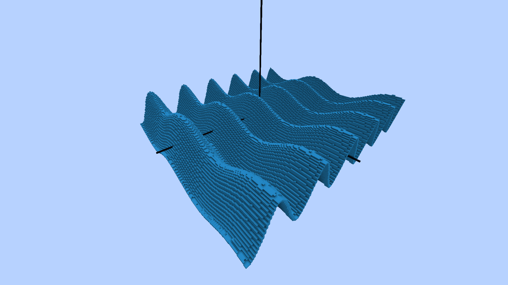

# MCGraph
A 3D Graphing Minecraft Bukkit plugin.

# Getting Started
1. Drag the <a href = MCGraph-1.0.0.jar>.jar file</a> into your server's plugins folder
2. Start a new void world
3. Type **/help MCGraph** ingame to see a list of available commands
4. Go to (0, 0) and start graphing :)

# Examples

